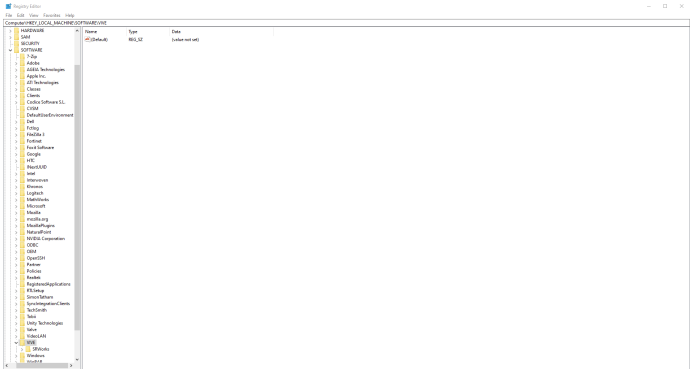
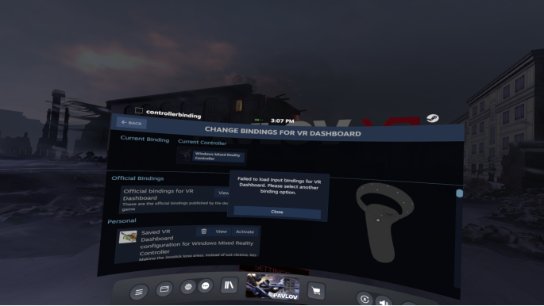
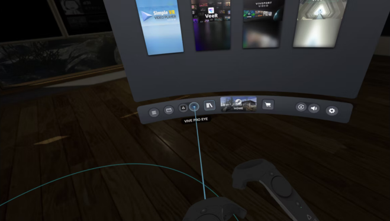
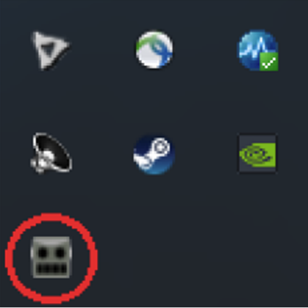

# SRanipal-Eye-Tracking-Manual
a guide on how to use the eye tracking capabilities of the VIVE Eye Pro headset.

# EYE TRACKING manual WITH **SRanipalRunner** and **SteamVR** for **Unity**

---

**NOTE: this manual is last updated on May the second 2023**

---

**The current software versions are the following:**

- *SRanipalRunner*: 1.3.2.0

- *SRanipal SDK*: 1.3.6.8

- *Unity Editor*: 2021.3.7f1

- *SteamVR*:1.26.2

- *VIVE CONSOLE for SteamVR*: 2.1.23.2

- *VIVE Setup : Latest*

---

## 1 Requirements

1. You need to have SteamVR installed and usable on your machine
2. You need to have the [Unity editor](https://unity.com/download) installed and working on your machine (all version after 2017)
3. You need to have [SRanipalRunner](https://hub.vive.com/en-US/download) installed on your machine
4. You need to download the [SteamVR plugin for unity](https://assetstore.unity.com/packages/tools/integration/steamvr-plugin-32647)
5. You need to download the [SRanipal SDK](https://developer-express.vive.com/resources/vive-sense/eye-and-facial-tracking-sdk/download/latest/).

---

## 2 How to solve installation problems with SRanipal after failed installations

Unfortunately, the installation process for SRanipalRunner may be troublesome do to some issues.
If you tried to install SRanipal in the past, but did not complete the instllation process, or you uninstalled the program after installation, now you may find yourself unable to install the program again and be presented with a 1001 error message, looking like this:

 

This problem is caused by residual folders left on your machine.

The solution is as follows:

1. make sure you uninstall SRanipal
2. Open the Windows command prompt (CMD) with admin rights and type in "sc delete SRanipalService".
3. Then delete 3 registry from regedit (Registry editor, you can find it in the search bar of Windows):

 

- \HKEY_LOCAL_MACHINE\SOFTWARE\VIVE\SRWorks\
- \HKEY_CURRENT_USER\Software\VIVE\SRWorks\
- \HKEY_LOCAL_MACHINE\SYSTEM\CurrentControlSet\Services\SranipalService\
4. Delete all files under C:\Programs\VIVE\SRanipal.
5. Reinstall SRAnipal.

At this point SRanipal should be executable.

---

## 3 Possible issues with SteamVR

During the installation process, trying to make use the eye tracking capabilities of the VIVE Eye Pro VR system, I encountered some difficulties with SteamVR.

I was presented with this error message:

 
 
The solution to this problem is to open the settings in SteamVR and throug **> settings > controllers > show binding interface > VR Dashboard** here is possible to choose the Default bindings or to use custom edited settings. I chose the former, but both should work.

---

## 4 Possible hardware issues

1. One problem that I found to be common is to have a system that allows you to attach the USB cable and the Display cable from your Headset to the system's GPU. Make sure that's the case.
2. Sometimes the controllers may not be bounded to the headset, to do so use the VIVE Setup or the VIVE CONSOLE for SteamVR. 

---

## 5 Eye Calibrating your VIVE Eye Pro

Before starting your eye-tracking-unity project make sure to calibrate your VIVE Eye Pro system for eye tracking.

1. Open the dashboard, in the menu in the bottom part of your visual field you should see an image like this:

 
 
2. From the menu that is open simply follow the instruction you are presented with, and press done once you are done.

 
---

## 6 (Finally) Starting your Unity eye-tracking-project

1. Open the Unity Hub and create a new 3D project
2. Install the SteamVR plugin in this project
3. Install the SRanipal SDK. To do so just unzip the SDK, and through >SDK>02_Unity you will find a file named *Vive-SRanipal-Unity-Plugin.unitypackage*. Simply double click on it, and when asked which version of the Unity editor you want to open the package with specify the version you are currently using
4. Along with the Unity Editor run **SRanipalRunner** and **SteamVR**
5. To run SRanipalRunner just double click the robot head icon on your desktop
6. if the program is running correctly, you should see a small icon in the status bar, like this:

 
 
7. it is important for you to notice the color of the eyes of the robot:
 - if they are black, Sranipal does not recognize the headset. either the headset is not connected properly, or SteamVR does not run correctly, or both.
 
  
 
 - if they are orange, Sranipal does recognize the headset and is on idle. if you do not have any motion capture program in unity running it should look like this.
 
  
  
 - if they are black, Sranipal does not recognize the headset. either the headset is not connected properly, or SteamVR does not run correctly, or both.
 
  
 
 If the Robot eyes are like in the last image, **Congratulations!!!** you are now using the eye tracking capabilities of the VIVE Eye pro system in your project!
 
 
 
 
 # END :) :) :) :) :)
 
 
 Feel free to add to this documentation or to share it whit whomever you want.
